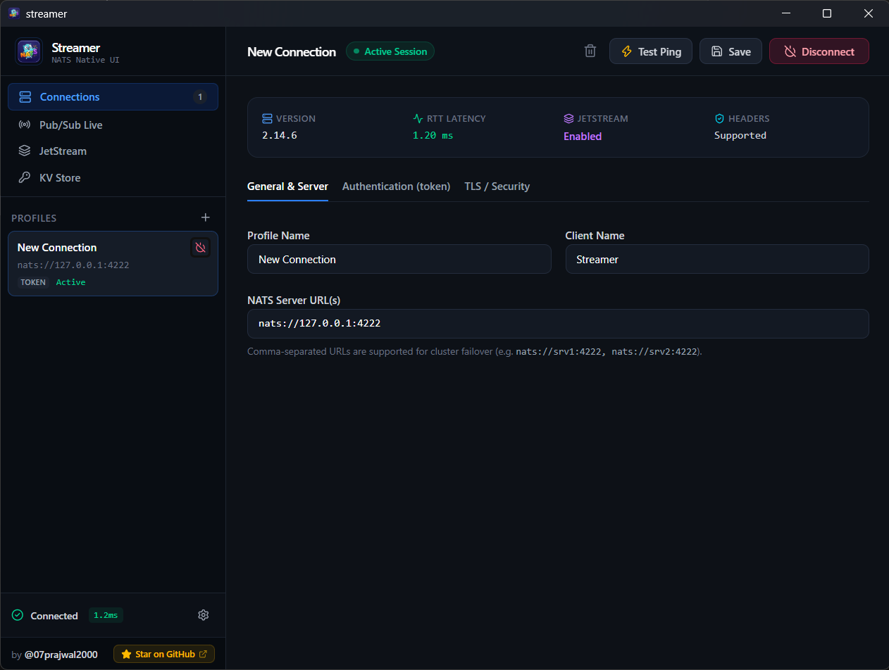

<h1 align="center">Streamer ⚡</h1>

<p align="center">
  
</p>

<p align="center">
  <b>A modern, high-performance desktop GUI client for NATS, JetStream, and Key-Value (KV) Buckets.</b>
  <br />
  Built with <b>Go</b>, <b>Wails v2</b>, <b>React</b>, <b>TypeScript</b>, and <b>Tailwind CSS</b>.
</p>


<p align="center">
  <a href="https://github.com/07prajwal2000/streamer">
    
  </a>
  
  
  
</p>

---



## 🌟 Overview

**Streamer** is an intuitive, fast, developer-centric desktop management application for [NATS.io](https://nats.io). It allows you to monitor and interact with core NATS Pub/Sub messaging, inspect and purge JetStream streams & consumers, browse stream message payloads (with formatted JSON tree and hex viewers), and manage Key-Value buckets with revision history.

---

## ✨ Key Features

### 🔌 Connection Management
- **Multiple Connection Profiles**: Connect to local dev instances (`nats://localhost:4222`), NATS NGS, Synadia Cloud, or private enterprise clusters.
- **Full Authentication Support**: Supports Anonymous, Username & Password, Token, and NKey / User Credentials (`.creds` file).
- **Live Health Diagnostics**: Real-time heartbeat, round-trip time (RTT latency in ms), server clustering details, and client tracking.

### 📡 Core Pub/Sub Live Streamer
- **Multi-Subject Subscription**: Subscribe to multiple subjects with wildcard support (`foo.*`, `events.>`).
- **Interactive Publisher**: Publish messages with custom subject, payload, and structured NATS headers.
- **Message Inspection**: Auto-detects JSON with interactive collapsible tree views, syntax highlighting, and raw / hex-dump modes.
- **Resizable Layout**: Drag panel borders to resize subscriptions, message feeds, and publisher windows.

### 🚀 Advanced JetStream Management
- **Full Stream Lifecycle**: Create, edit, inspect, seal, and purge JetStream streams.
- **Message Browsing by Default**:
  - **Message List Mode (Default)**: Batch browsing with customizable limits (50, 100, 200, 500), auto-polling live reload, and keyword filter.
  - **Single Sequence Stepper**: Jump directly to first, last, or any sequence number with prev/next controls.
- **Headers & Metadata**: Inspect raw NATS message headers, sequence IDs, timestamps, and delivery counts.
- **Schedule Stream Viewer**: Built-in visual indicator and schedule trigger preview for cron/scheduled streams.
- **Consumer Management**: Inspect push and pull consumers, filter subjects, ack policies, replay policies, and pending message counts.

### 🔑 Key-Value (KV) Bucket Explorer
- **Bucket Operations**: Create buckets with custom TTLs, max history (revisions per key), and storage backends (File vs. Memory).
- **Interactive Put Key Modal**:
  - Generous wide dialog with dual edit and syntax-highlighted formatted tree tabs.
  - One-click JSON prettifier and instant validation badge.
- **Revision History**: Inspect all historical values and timestamps of any key.
- **Watch & Search**: Fast filtering across keys and real-time refresh.

---

## 🛠️ Architecture & Tech Stack

- **Desktop Framework**: [Wails v2](https://wails.io/)
- **Backend**: [Go](https://go.dev/) with `nats.go`
- **Embedded Database**: SQLite with `modernc.org/sqlite` (pure Go, CGO-free)
- **Frontend**: React 18, TypeScript, Tailwind CSS v4, Lucide Icons

---

## 🚀 Getting Started

### Prerequisites
- [Go](https://go.dev/dl/) 1.21+
- [Node.js](https://nodejs.org/) 18+ and `npm`
- [Wails CLI](https://wails.io/docs/gettingstarted/installation):
  ```bash
  go install github.com/wailsapp/wails/v2/cmd/wails@latest
  ```

### Development Mode
Start the live development environment with hot reloading:
```bash
wails dev
```

### Production Build

#### Windows & Linux (Automated via GitHub Actions)
Production builds for **Windows (x64)** and **Linux (x64)** are automatically compiled, checksummed (`SHA256SUMS.txt`), and published to GitHub Releases whenever a version tag is pushed:
```bash
git tag v1.0.0
git push origin v1.0.0
```

#### Local Manual Build (Windows / Linux)
```bash
wails build
```
Output binary will be located in `build/bin/streamer.exe` (Windows) or `build/bin/streamer` (Linux).

---

### 🍏 Building on macOS (Apple Silicon / Intel)

Due to Apple code-signing and notarization requirements for distribution, **macOS users should build Streamer locally on their Mac**:

1. **Install Prerequisites**:
   - Install **Xcode Command Line Tools**:
     ```bash
     xcode-select --install
     ```
   - Install **Go (1.21+)** & **Node.js (18+)**:
     ```bash
     brew install go node
     ```
   - Install the **Wails CLI**:
     ```bash
     go install github.com/wailsapp/wails/v2/cmd/wails@latest
     ```

2. **Clone & Install Dependencies**:
   ```bash
   git clone https://github.com/07prajwal2000/streamer.git
   cd streamer/frontend && npm install && cd ..
   ```

3. **Build the Native macOS Application (`.app`)**:
   - **For Apple Silicon (M1/M2/M3/M4)**:
     ```bash
     wails build -platform darwin/arm64
     ```
   - **For Intel Macs**:
     ```bash
     wails build -platform darwin/amd64
     ```
   - **Universal Binary (Both Apple Silicon & Intel)**:
     ```bash
     wails build -platform darwin/universal
     ```

4. **Launch the App**:
   The packaged app bundle is created at:
   ```
   build/bin/streamer.app
   ```
   Drag `streamer.app` to your `/Applications` folder, or run:
   ```bash
   open build/bin/streamer.app
   ```
   *(Note: If macOS displays a Gatekeeper prompt on first launch, right-click `streamer.app` and choose **Open**, or run `xattr -cr /Applications/streamer.app`).*

---

## 👤 Author & Credits

Created by **[@07prajwal2000](https://github.com/07prajwal2000)**.

If you find this project useful, please consider giving it a ⭐️ on GitHub:
👉 [https://github.com/07prajwal2000/streamer](https://github.com/07prajwal2000/streamer)

---

## 📄 License

This project is licensed under the MIT License.
